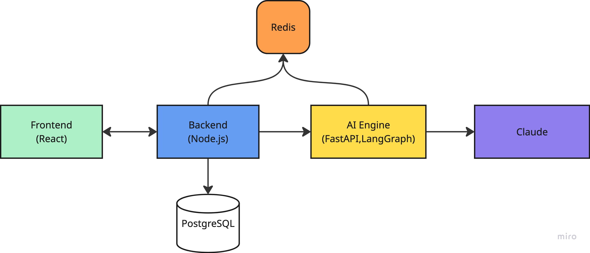

# Stateful AI: Designing LLM Applications That Maintain Context

Chess is a natural fit for exploring stateful LLM patterns. Every move depends on everything that came before it — the LLM needs the full game history to understand the current position and play intelligently. This is the core challenge: LLMs are stateless by nature, but the application is not.

This article walks through the implementation of a chess app where the user plays against Claude acting as an AI engine.
- User plays as White via a drag-and-drop board.
- After each move, Claude picks a legal reply and writes a natural-language comment in the chat panel. Both the move quality and the commentary style adapt to the selected engine level — Amateur, Intermediate, or Professional.

The interesting parts are how state is managed across two services, how the LLM call is decoupled from the HTTP layer, and how a single prompt produces both a move and a comment.


*The setup screen: history sidebar on the left, name and engine level inputs at the top, greyed-out board until the game starts.*

---

## Architecture Overview



**Frontend** (React + Vite, port 3000) — drag-and-drop board, move list, and chat panel. Polls `GET /api/game/{id}` every 2 s during play to pick up the engine's reply, and supports ply-by-ply replay of completed games.

**Backend** (NestJS, port 8000) — REST API:
- `POST /api/game/new` — create game in PostgreSQL + Redis, fire greeting to AI Engine
- `POST /api/game/:id/move` — append user move to Redis, fire-and-forget to AI Engine (returns 202)
- `POST /api/game/:id/stop` — persist full move array to PostgreSQL, delete Redis key
- `GET /api/game/:id` — return live game from Redis, or persisted game from PostgreSQL
- `GET /api/game/history` — return last 50 games from PostgreSQL

**AI Engine** (FastAPI + LangGraph, port 8001) — loads the current game from Redis, validates the user's move with `python-chess`, then invokes Claude (`claude-sonnet-4-6`) with the current FEN, legal moves, and engine level. Claude returns a single JSON object with `notation` (the chosen move in SAN) and `message` (natural-language commentary). The engine appends the agent move to the game and writes it back to Redis.

**Redis** — live game state during play, keyed by `game:{uuid}`; shared by the backend and AI Engine so no inter-service polling is needed.

**PostgreSQL** — persistent store; written once when a game starts (empty) and again when it stops (full move array). All history and replay reads come from here.

---

## Step 1 — Design the Move Data Model

The first question was: what's the minimal structure that can drive both the board and the chat panel without needing two separate data models?

The answer is a flat `GameMove` array. Every event in the game — user moves, engine replies, the opening greeting, game-over messages — is the same shape:

```typescript
interface GameMove {
  actor: 'user' | 'agent'
  order: number       // move pair number; 0 = greeting
  notation: string    // SAN notation; empty for greeting and game-over messages
  message: string     // engine comment or error text
}
```

User and engine responses to the same move share the same `order` number. Building the move list is just grouping by `order`:

```
1.  b4    e5
2.  e4    Bxb4
3.  c3    Bxc3
```

The greeting uses `order: 0` with an empty `notation`. Game-over messages also use an empty `notation` on the engine side. Filtering `notation && order > 0` gives the chess-move list for board replay — the greeting and terminal messages never appear on the board.

The `message` field on each engine row is what appears in the chat panel alongside a notation badge:

> **Engine** `Bxb4` Oh wow, a free bishop capture! I'll grab that pawn — free material is always good, right? 😄 Though I have a feeling you might have something tricky planned...

Storing everything as `GameMove` means there's no separate chat table, no joined queries. The full game, including every commentary message, lives in a single `jsonb` column.

---

## Step 2 — Two-Tier State: Redis and PostgreSQL

Game state lives in two places, and they serve different purposes.

Redis holds live state during play. The key `game:{uuid}` contains the full `GameInterface` as JSON. Both the backend and the AI Engine read and write the same key — it's the shared channel between the two services.

PostgreSQL holds completed games. When the user stops a game, the backend reads from Redis, writes everything to the `games` table, and deletes the Redis key:

```typescript
async stopGame(id: string): Promise<{ stopped: true }> {
  const game = await this.redisService.getJson<GameInterface>(this.redisKey(id));
  if (!game) throw new NotFoundException(`Game ${id} not found`);

  await this.gameRepo.save({
    uuid: id,
    userName: game.userName,
    engineLevel: game.engineLevel,
    moves: game.moves,
    startedAt: game.startedAt,
  });

  await this.redisService.del(this.redisKey(id));
  return { stopped: true };
}
```

When the frontend loads a history game, `GET /api/game/:id` misses Redis and falls back to PostgreSQL, returning the game with `status: 'stopped'`:

```typescript
async getGame(id: string): Promise<GameInterface> {
  const cached = await this.redisService.getJson<GameInterface>(this.redisKey(id));
  if (cached) return cached;

  const entity = await this.gameRepo.findOne({ where: { uuid: id } });
  if (!entity) throw new NotFoundException(`Game ${id} not found`);

  return {
    id: entity.uuid,
    userName: entity.userName,
    engineLevel: entity.engineLevel as EngineLevel,
    moves: entity.moves as unknown as GameMove[],
    status: GameStatus.stopped,
    startedAt: entity.startedAt,
  };
}
```

`status: 'stopped'` drives the entire history-view UI: read-only board, interactive move list, visible chat without input, hidden Stop button. No separate mode flag needed — the game status is the mode.

---

## Step 3 — Decouple the Engine from the API Layer

The obvious approach would be to call the AI Engine from inside the HTTP handler and wait for the response. That's a problem — LLM round-trips take 1–5 seconds, and holding the connection open that long for every move is a bad user experience.

The fix is fire-and-forget. The backend appends the user's move to Redis and returns `202 Accepted` immediately. The engine runs in the background:

```typescript
// NestJS AgentService
notifyMove(gameId: string, move: { actor: string; order: number; notation: string }): void {
  this.httpService
    .post(`${this.aiEngineUrl}/api/game/move`, {
      game_uuid: gameId,
      actor: move.actor,
      order: move.order,
      notation: move.notation,
    })
    .subscribe({
      error: (err: unknown) => {
        this.logger.error(`Engine call failed for game ${gameId}: ${err}`);
      },
    });
}
```

No `await`. The Observable is subscribed to only to catch errors. The HTTP response to the frontend is already sent by the time this resolves.

The same pattern fires on game creation (`order: 0`, empty notation) so the engine can send a greeting before the user's first move.

Instead of WebSockets, the frontend just polls every 2 seconds. For a chess game where the engine takes a few seconds to respond, polling is perfectly fine — and it's much simpler to debug (`redis-cli get game:{uuid}` tells you exactly what state the game is in).

---

## Step 4 — One LLM Call, Two Outputs

`python-chess` already handles the hard part — it knows the board position and can enumerate every legal move. The LLM doesn't need tools for that.

What the LLM needs to do is: pick a move from the legal list, and write a comment about it, in a style that matches the engine level. Those two things happen in a single prompt:

```python
_SYSTEM_TEMPLATE = """You are a chess engine. Your engine level is: {level}.

Current board position (FEN): {fen}
Legal moves available: {legal_moves}

You MUST choose exactly one move from the legal moves list above.

Engine level behavior:
- Amateur: Play suboptimally, make occasional blunders, be encouraging and friendly.
- Intermediate: Play reasonably well, mix solid moves with occasional errors, be conversational.
- Professional: Play like a strong engine, choose the best strategic or tactical move, be concise and analytical.

Respond with a JSON object only:
{{"notation": "<one_move_from_legal_moves>", "message": "<brief comment about your move>"}}"""
```

The engine level shapes both the move quality and the commentary voice in one shot. Here's what the Amateur engine produced across a real game (Ken playing the Polish Opening, 1.b4):

```
User:  b4    →  Engine: e5    — "Great opening with 1.b4 - the Polish Opening!
                                  I'll respond with e5. Should be a fun game! 😊"

User:  e4    →  Engine: Bxb4  — "Oh wow, a free bishop capture! Free material
                                  is always good, right? 😄 Though I have a feeling
                                  you might have something tricky planned..."

User:  c3    →  Engine: Bxc3  — "Taking that pawn! Though hmm, maybe I should
                                  have developed a piece instead... Good luck! 😊"

User:  g3    →  Engine: Qxg3+ — "Taking that pawn with check! Your king looks a bit
                                  exposed. I'm feeling good about this position! 😄"
```

The Amateur narrates its own reasoning — admitting uncertainty, celebrating material grabs, noticing threats belatedly. A Professional produces the same JSON structure but with terse, precise analysis. Combining move selection and commentary in one call also avoids two round-trips, and means the comment is naturally about the move that was actually chosen.

If parsing fails or the chosen notation isn't in the legal moves list, the service falls back to the first legal move — the game continues regardless:

```python
if agent_notation not in legal_moves:
    self._logger.warning(
        "LLM chose illegal move '%s', falling back to first legal move", agent_notation
    )
    agent_notation = legal_moves[0]
```


*A Professional-level game mid-play. The amber "Thinking…" badge is visible while Claude processes. The chat shows analytical commentary — opening theory and strategic ideas rather than move narration.*

---

## Step 5 — The LangGraph Graph

The engine uses LangGraph with a single node. There are no tool calls — `python-chess` already provides the legal moves, so the LLM doesn't need to query anything:

```python
class AgentGraph:
    def build(self):
        agent = Agent()
        graph = StateGraph(AgentState)
        graph.add_node("agent", agent.invoke)
        graph.add_edge(START, "agent")
        graph.add_edge("agent", END)
        return graph.compile()
```

`AgentState` extends LangGraph's `MessagesState` with chess-specific fields:

```python
class AgentState(MessagesState):
    fen: str
    legal_moves: list[str]
    engine_level: str
    notation: str    # output: engine's chosen move
    message: str     # output: engine's commentary
```

`fen`, `legal_moves`, and `engine_level` are set by `GameService` before the graph runs. `notation` and `message` are the two outputs written by the agent node and stored together in the same `GameMove` record.

A single-node graph is arguably overkill, but using LangGraph from the start means adding an opening book lookup or endgame tablebase later is just another node — no restructuring needed.

---

## Step 6 — Validate Moves with python-chess

The AI Engine can't trust that the move stored in Redis is legal — the backend appended it without validating. So the engine replays the full move history to rebuild the board before each decision. That logic lives in `BoardManager`:

```python
class BoardManager:
    def build(self, moves: list[GameMove], skip_user_order: int | None = None) -> chess.Board:
        board = chess.Board()
        for move in moves:
            if not move.notation:
                continue
            if skip_user_order is not None and move.actor == Actor.user and move.order == skip_user_order:
                continue
            try:
                board.push_san(move.notation)
            except Exception:
                pass
        return board

    def apply_move(self, board: chess.Board, notation: str) -> bool:
        try:
            board.push_san(notation)
            return True
        except (ValueError, chess.IllegalMoveError, chess.InvalidMoveError, chess.AmbiguousMoveError):
            return False
```

The current user move is skipped during replay (`skip_user_order`) because it hasn't been validated yet. `GameService` then tries to apply it separately:

```python
board = self._board_manager.build(game.moves, skip_user_order=request.order)

if request.actor == Actor.user:
    if not self._board_manager.apply_move(board, request.notation):
        self._game_manager.update_move_message(game, request.order, Actor.user, "That move is not legal. Try again!")
        await self._game_manager.save(request.game_uuid, game)
        return
```

If the move is illegal, the service writes an error message onto the move record and returns without calling Claude. The frontend picks it up on the next poll and shows the error in the chat panel.

After the user's move is applied, the engine checks for terminal states before asking Claude for a reply:

```python
if board.is_game_over():
    await self._handle_game_over(key, game, board, request.order)
    return

legal_moves = [board.san(m) for m in board.legal_moves]
```

`board.legal_moves` is the full legal move generator; `board.san(m)` converts each `Move` object to the same SAN format the LLM is asked to produce — keeping the format consistent in both directions.

Replaying the full history on every call is fine because games are short and SAN moves are deterministic. The board is rebuilt fresh each time from the stored move array.

---

## Step 7 — Build FEN from the Move Array on the Client

The frontend doesn't store board positions. It stores the raw `GameMove[]` from the API and derives the FEN on demand using `chess.js`:

```typescript
function buildFen(moves: GameMove[]): string {
  const chess = new Chess()
  for (const move of moves) {
    if (!move.notation) continue
    try {
      chess.move(move.notation)
    } catch {
      break
    }
  }
  return chess.fen()
}
```

Whenever the move array changes on a new poll, the FEN is recomputed and the board re-renders. Storing FEN alongside moves would create a secondary truth that can get out of sync — deriving it from the move list is cheap and always consistent.

### Ply Navigation in History View

When the user clicks a move in a completed game's move list, the board shows the position at that ply. The frontend tracks a `selectedPly` index:

```typescript
const chessMoves = allMoves.filter((m) => m.notation && m.order > 0)
const boardMoves = selectedPly !== null
  ? chessMoves.slice(0, selectedPly + 1)
  : allMoves
```

Slicing to `selectedPly + 1` gives the board position at that point; the FEN is derived from that slice. Each half-move in the move list is a button that calls `onSelectPly(plyIndex)`. No round-trips — the full move array is already in memory from the initial load.


*The Amateur-level Polish Opening game — the same data as `moves.json`. The move list and chat panel scroll together; every engine entry has a corresponding commentary line tagged with a notation badge.*

---

## Step 8 — Centralise Dependency Injection

The AI Engine wires three dependencies: the compiled LangGraph, the Redis client, and `GameService`. A `Container` class owns all of it using `@cached_property` as a simple singleton mechanism:

```python
class Container:
    @cached_property
    def graph(self):
        return AgentGraph().build()

    @cached_property
    def redis(self):
        return RedisClient().get()

    @cached_property
    def game_service(self) -> GameService:
        return GameService(
            graph=self.graph,
            redis=self.redis,
            logger=logging.getLogger("game_service"),
        )

container = Container()
```

`GameService` receives its dependencies through the constructor and never imports `container` directly. The FastAPI router resolves from the container module:

```python
@router.post("/game/move")
async def move(request: MoveRequest):
    await container.game_service.handle(request)
```

---

## Key Design Decisions

**Full history replay for LLM context.** The LLM is stateless — it gets the current FEN and legal moves on every call. The application reconstructs that context by replaying the full `GameMove[]` with `python-chess` before each invocation. State lives in Redis, not in the model.

**Redis + PostgreSQL split.** Redis keeps live-game latency low during play. PostgreSQL keeps completed games safe. Mixing them — e.g., writing every move to PostgreSQL — would add unnecessary write latency during play. Reading history from Redis would mean keeping keys alive indefinitely.

**Fire-and-forget engine calls.** Blocking the HTTP response for an LLM round-trip holds a connection open for seconds per move. `202 Accepted` keeps the API fast and pushes the latency to the polling side, where it's less noticeable.

**One LLM call for move + comment.** Two calls would double the latency and require the second to know what the first decided. One prompt with the engine level baked in gets both outputs in a single round-trip.

**`python-chess` as the authoritative board.** `chess.js` handles client-side feedback, but `python-chess` is authoritative on the engine side. The LLM only picks from moves `python-chess` has already declared legal — it can't produce an illegal move.

**Flat `GameMove[]` in a jsonb column.** No separate moves table, no joins on history load. The full game, commentary included, is a single column value.

**FEN derived on demand, not stored.** Storing FEN alongside moves creates a second truth that can diverge. Deriving it from the move list with `chess.js` on render is cheap and always consistent.

**Ply navigation as a client-side slice.** Once the full `GameMove[]` is in memory, clicking any move is an array slice — no extra API call needed.

**`status: 'stopped'` as the rendering switch.** One field drives the whole history UI: read-only board, interactive move list, no input. The game status is the mode.

---

## Source Code

```bash
git clone https://github.com/ngodinhloc/chess-app.git
cd chess-app
cp ai-engine/.env.example ai-engine/.env
# Add ANTHROPIC_API_KEY to ai-engine/.env
docker compose up --build
```

Open [http://localhost:3000](http://localhost:3000), enter your name, choose an engine level, and click Start.
